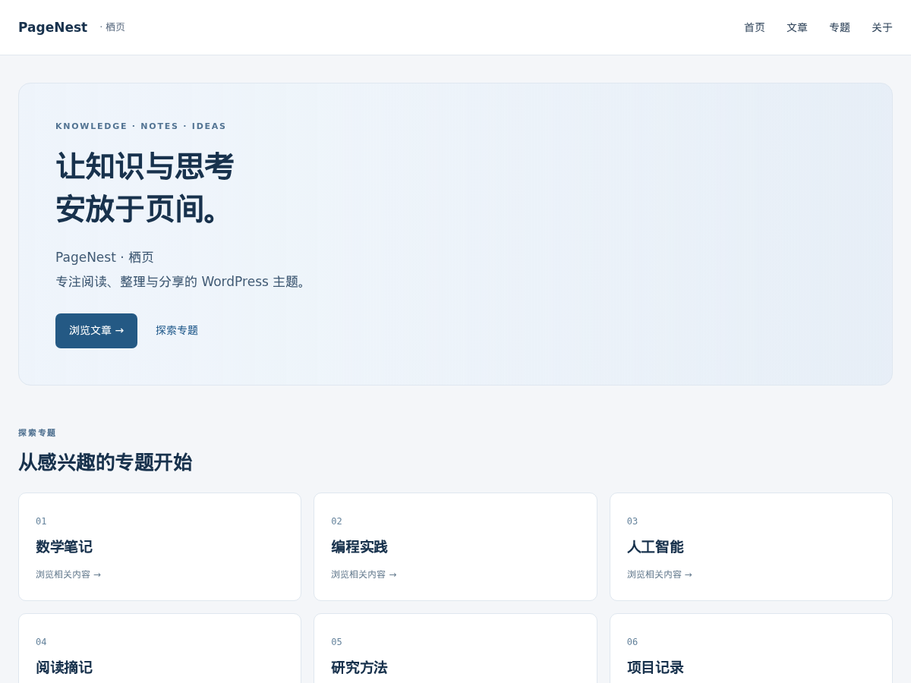

# PageNest · 栖页

让知识与思考安放于页间。面向技术笔记与长文阅读的独立经典 WordPress 主题。

A reading-focused WordPress theme for technical notes and thoughtful writing.

  

[下载主题](https://github.com/wzf2000/PageNest/releases) · [更新记录](CHANGELOG.md) · [问题反馈](https://github.com/wzf2000/PageNest/issues)

_预览采用合成演示内容；安装主题不会导入示例文章或站点图片。_

## 功能

- **专注阅读**：分层文章目录支持分支折叠、展开全部和当前位置提示；手机目录默认收起，没有小标题时仍可跳至正文。
- **定制首页**：通过 WordPress 原生自定义器设置背景、介绍、最多六个专题与七位作者展示。
- **响应式布局**：桌面两列文章卡片、全宽 16:9 封面，手机单列；提供文章、页面、归档、搜索与 404 模板。
- **完整站点外观**：原生评论与密码保护、导航、登录/注册背景及提示语、页脚署名和可选备案号。

## 开始使用

需要 **WordPress 6.0+、PHP 8.0+**，无需父主题。

1. 从 [GitHub Releases](https://github.com/wzf2000/PageNest/releases) 下载发行附件中的 `pagenest-版本号.zip`。
2. 在后台 “外观 → 主题 → 安装主题 → 上传主题” 上传 ZIP，安装并启用。
3. 分配 “全站主导航”，在 “外观 → 自定义 → 栖页首页设置” 配置背景、专题与作者。

站点标题与 Logo 在 “站点身份” 中设置；下载时选择发行安装包，避免使用 Source code ZIP。

> [完整安装、配置与旧版升级指南](https://github.com/wzf2000/PageNest/blob/main/docs/USAGE.md)

## 配置与搭配

首页介绍支持换行。自定义器中的 “页脚信息”“交流区”“归档与关于链接” 用于配置站点文案和链接；“登录与注册” 调整登录页外观。图片由使用者自行上传并确认使用权。

需要评论邮件通知、旧 Markdown 编辑器或公式兼容时，可安装独立的 [PageNest Compatibility](https://github.com/wzf2000/PageNest-Compatibility)。私人笔记、积分、点赞和社交登录需另行接入。

> [配置说明与阅读行为](https://github.com/wzf2000/PageNest/blob/main/docs/USAGE.md)

## 更多文档

> [使用指南](https://github.com/wzf2000/PageNest/blob/main/docs/USAGE.md) — 安装、首页配置、阅读与升级。
>
> [扩展接口](https://github.com/wzf2000/PageNest/blob/main/docs/EXTENDING.md) — 设置键、相关文章与阅读布局接入。
>
> [贡献指南](https://github.com/wzf2000/PageNest/blob/main/CONTRIBUTING.md) — 本地开发、格式和检查。
>
> [发行指南](https://github.com/wzf2000/PageNest/blob/main/docs/RELEASING.md) — CI、打包与 GitHub Release。

## 许可证

代码与随附演示截图采用 **GPL-2.0-or-later**，详见 [LICENSE](LICENSE)。版权归 PageNest Contributors（2026）所有；站点上传的图片与媒体不随主题分发。
